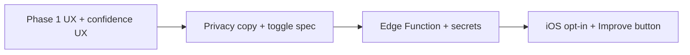

# Plan: Hybrid photo recognition (on-device + optional AI)

**Status:** Draft plan  
**Last updated:** 2026-04-10  
**Principle:** Default stays **private and on-device**; **opt-in** cloud improves naming when the user asks or when local confidence is low.

---

## 1. Goals

| Goal | Success signal |
|------|------------------|
| Fast add for packaged goods | Barcode + catalog path is obvious and reliable |
| Useful add for loose produce | Local photo hint improves name/category without feeling “random” |
| Trust | No silent upload of full-resolution pantry photos |
| Optional quality | User (or low-confidence path) can invoke cloud once with clear consent |

---

## 2. Phase 1 — Product & local ML (no new backend)

**Duration (indicative):** 1–2 sprints  
**Outcome:** Better UX and clearer limits of on-device Vision; no new infra.

### 2.1 IA & copy

- [ ] **Add to pantry** hub: visual order **Barcode → Search catalog → Identify from photo → Manual** (photo as *hint*, not primary for packaged goods).
- [ ] Short **footer / tooltip** under photo actions: local processing, may be wrong, edit before save.
- [ ] After local recognition, if category is **Other** or confidence &lt; threshold (see 2.3), show inline **“Not quite right? Edit name or category.”** (no cloud yet).

### 2.2 On-device pipeline (incremental)

- [ ] Expose **confidence** from `ProductRecognitionResult` in UI when below a tunable threshold (e.g. `&lt; 0.35`) so users know the guess is weak.
- [ ] Optional: **prefill quantity** from OCR digits on packaging (separate small task; only if easy and safe).

### 2.3 Thresholds (tuning)

- [ ] Define constants: `visionConfidenceStrong`, `visionConfidenceWeak` (e.g. 0.35 / 0.15) — document in code + this file.
- [ ] **Weak** path: show banner only (Phase 1). **Phase 2:** same flag enables “Improve with AI” CTA.

### 2.4 Quality & support

- [ ] Add **FAQ / Privacy** one-liner: photo identification runs on device; optional online help described when shipped (Phase 2).
- [ ] **Analytics** (if you use events): `photo_recognize_local_success`, `photo_recognize_local_weak` (no PII).

### 2.5 Testing

- [ ] Snapshot / UI test: hub order and weak-confidence banner (if added).
- [ ] Unit tests: mapper + threshold helpers only (keep fast).

---

## 3. Phase 2 — Opt-in cloud “Improve with AI”

**Duration (indicative):** 2–3 sprints after Phase 1  
**Pre-requisites:** Privacy Policy + App Store “Data Used to Track” / “Data Linked to You” updates as applicable; API key **never** in the iOS binary.

### 3.1 Architecture

```
[iOS]  --JPEG + session JWT-->  [Supabase Edge Function]  --HTTPS-->  [Provider: OpenAI / Gemini / …]
         POST /identify-grocery-photo
```

- [ ] **Edge Function** `identify-grocery-photo` (name TBD):
  - Validates **JWT** (logged-in user only) + optional **rate limit** (per user / day).
  - Accepts **base64 JPEG** or multipart, max size (e.g. 1–2 MB), max dimensions (e.g. 1024 px).
  - Calls provider with a **strict JSON schema** prompt: `{ "name": string, "category": string, "confidence": number }` constrained to your `predefinedCategories` (+ “Other”).
  - Returns JSON + **no image retention** in your DB (stateless request; provider logs per their DPA).
- [ ] **Secrets:** Provider key in Supabase secrets / env, rotated if leaked.

### 3.2 iOS app changes

- [ ] **Settings → Privacy / Labs:** toggle **“Allow online photo help”** (default **off** until user opts in).
- [ ] **Add item sheet:** button **“Improve with AI”** visible only if toggle on **and** (user taps **or** local confidence weak — product choice: auto-offer vs tap-only; recommend **tap-only** for v1 of Phase 2 to minimize surprise uploads).
- [ ] **Before first use:** one-time **sheet**: what is sent, retention, link to privacy policy; **Agree** stores flag in Keychain or app settings.
- [ ] **Client:** resize + JPEG before upload; show spinner; merge result into name/category; user still edits and saves.
- [ ] **Errors:** network, rate limit, provider down → toast + keep local result.

### 3.3 Security checklist

- [ ] Auth on Edge Function (Supabase JWT verify).
- [ ] Rate limiting + payload size limit.
- [ ] No API keys in app; TLS only; optional request id for support logs (no image in logs).
- [ ] **Child / sensitive:** avoid sending photos that clearly show minors (policy text); optional “don’t send faces” crop later.

### 3.4 Legal / store

- [ ] Update **Privacy Policy** (categories sent, purpose, processors, retention).
- [ ] **App Store** privacy nutrition labels if data leaves device for this feature.
- [ ] EU/UK: lawful basis (consent) documented for optional upload.

### 3.5 Testing

- [ ] Contract tests against Edge Function with **mock provider** in CI (no real key).
- [ ] Manual: opt-in off → no network call; on → success + failure paths.

---

## 4. Open decisions (resolve before Phase 2 build)

1. **Provider:** OpenAI vs Gemini vs Anthropic (cost, latency, EU data residency).
2. **Trigger:** Tap-only “Improve with AI” vs auto-prompt when weak (recommend **tap-only** first).
3. **Billing:** Per-household cap vs global rate limit; whether **Pro** feature only.

---

## 5. Dependency order



---

## 6. Out of scope (for this plan)

- Training custom Core ML for groceries (separate initiative).
- Sending every camera frame to the cloud.
- Storing user photos in Supabase Storage for recognition (keep stateless unless you explicitly want history).

---

## 7. Done definition

- **Phase 1:** Hub IA updated; weak-confidence messaging; thresholds documented; FAQ/privacy line; tests green.
- **Phase 2:** Toggle + consent flow; Edge Function in staging; iOS calls only when opted in; policy + App Store metadata updated; rate limits verified.
